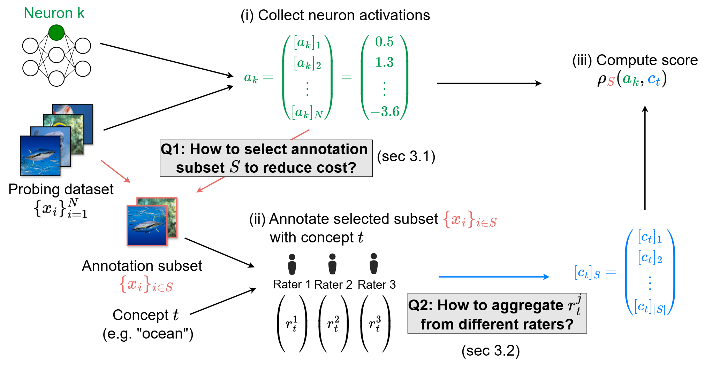

# Rethinking Crowd-Sourced Evaluation of Neuron Explanations

This is the official repo of our paper *Rethinking Crowd-Sourced Evaluation of Neuron Explanations*, full code and results will be released later, please stay tuned.

 * In this work, we conduct the first crowd-sourced neuron explanation evaluation utilizing a proper evaluation metric, namely correlation coefficient that measures whether the explanation matches neuron activations beyond just the very highest activations
 * We show how to effectively utilize Importance Sampling to select most important inputs to show raters, leading to ∼30× reduction in labeling cost over uniform sampling.
 * We develop a Bayes-based method to aggregate predictions of different raters to deal with noisy labels, further reducing the cost of reaching a certain accuracy by ∼5×.
  



## Cite this work
T. Oikarinen, G. Yan, A. Kulkarni and T.-W. Weng, *Rethinking Crowd-Sourced Evaluation of Neuron Explanations*, arXiv preprint, 2025.

```
@misc{oikarinen2025rethinking,
  title={Rethinking Crowd-Sourced Evaluation of Neuron Explanations}, 
      author={Tuomas Oikarinen and Ge Yan and Akshay Kulkarni and Tsui-Wei Weng},
      year={2025},
      eprint={2506.07985},
      archivePrefix={arXiv},
      primaryClass={cs.CV},
      url={https://arxiv.org/abs/2506.07985}, 
}